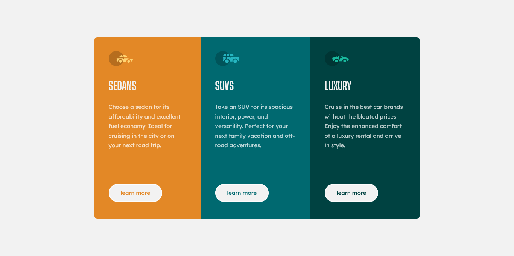

# Frontend Mentor - 3-column preview card component solution

This is a solution to the [3-column preview card component challenge on Frontend Mentor](https://www.frontendmentor.io/challenges/3column-preview-card-component-pH92eAR2-). Frontend Mentor challenges help you improve your coding skills by building realistic projects. 

## Table of contents

- [Overview](#overview)
  - [The challenge](#the-challenge)
  - [Screenshot](#screenshot)
- [My process](#my-process)
  - [Built with](#built-with)
  - [What I learned](#what-i-learned)
  - [Continued development](#continued-development)
  - [Useful resources](#useful-resources)
- [Author](#author)

## Overview

### The challenge

Users should be able to:

- View the optimal layout depending on their device's screen size
- See hover states for interactive elements

### Screenshot

## My process

### Built with

- CSS custom properties
- Flexbox
- BEM

### What I learned

I didn't learn anything new in this project. I took this project to practice what I already knew. If there's anything new that I tried, it's probably the use of @media element, or media query.

### Continued development

In future projects I wanna focus on:
Responsive web design (Mobile-first workflow, Media Queries)
Typography (Em & Rem units)
CSS Flexbox & Grid
CSS Methodology (BEM)

### Useful resources

- [Kevin Powell](https://www.youtube.com/kepowob) - I watched his videdo regarding CSS units. This is a great channel that focuses on CSS.

## Author

- Frontend Mentor - [@arey-dev](https://www.frontendmentor.io/profile/arey-dev)
